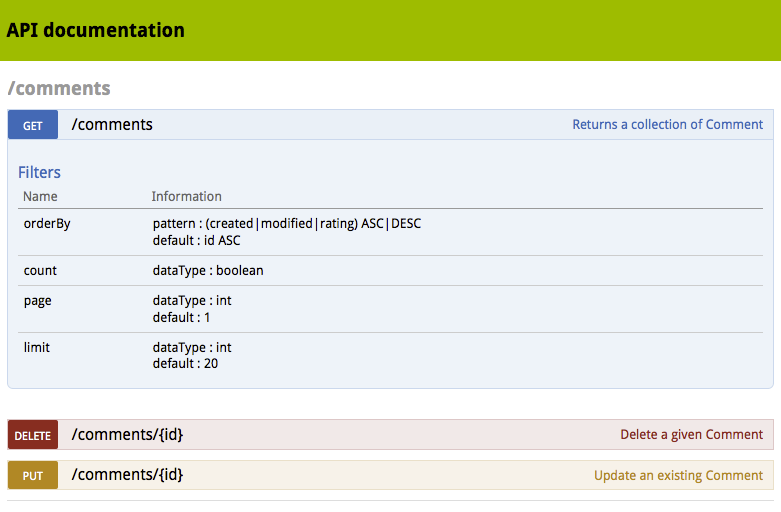
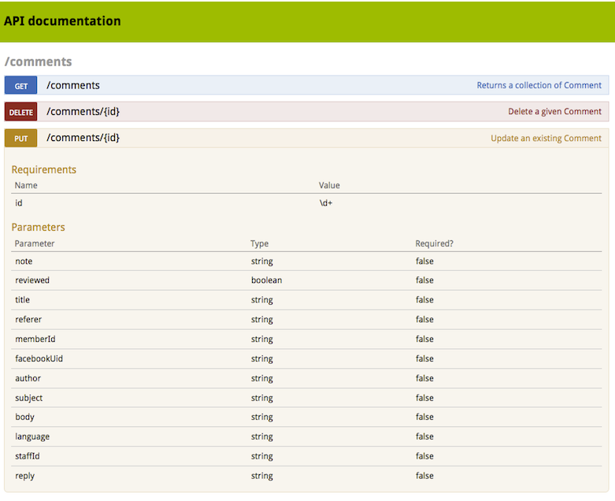

NelmioApiDocBundle
==================

The **NelmioApiDocBundle** bundle allows you to generate a decent documentation
for your APIs.

Installation
------------

Step 1: Download the Bundle
---------------------------

Open a command console, enter your project directory and execute the
following command to download the latest stable version of this bundle:

.. code-block:: bash

    $ composer require nelmio/api-doc-bundle

This command requires you to have Composer installed globally, as explained
in the `installation chapter`_ of the Composer documentation.

Step 2: Enable the Bundle
-------------------------

Then, enable the bundle by adding it to the list of registered bundles
in the ``app/AppKernel.php`` file of your project:

.. code-block:: php

    <?php
    // app/AppKernel.php

    // ...
    class AppKernel extends Kernel
    {
        public function registerBundles()
        {
            $bundles = array(
                // ...
                new Nelmio\ApiDocBundle\NelmioApiDocBundle(),
            );

            // ...
        }

        // ...
    }

Step 3: Register the Routes
---------------------------

Import the routing definition in ``routing.yml``:

.. code-block:: yaml

  # app/config/routing.yml
  NelmioApiDocBundle:
      resource: "@NelmioApiDocBundle/Resources/config/routing.yml"
      prefix:   /api/doc

Step 4: Configure the Bundle
----------------------------

Enable the bundle's configuration in ``app/config/config.yml``:

.. code-block:: yaml

    # app/config/config.yml
    nelmio_api_doc: ~

The **NelmioApiDocBundle** requires Twig as a template engine so do not forget
to enable it:

.. code-block:: yaml

    # app/config/config.yml
    framework:
        templating:
            engines: ['twig']

Usage
-----

The main problem with documentation is to keep it up to date. That's why the
**NelmioApiDocBundle** uses introspection a lot. Thanks to an annotation, it's
really easy to document an API method. The following chapters will help you
setup your API documentation:

.. toctree::
    :maxdepth: 1

    the-apidoc-annotation
    multiple-api-doc
    other-bundle-annotations
    swagger-support
    dunglasapibundle
    sandbox
    commands
    configuration-in-depth
    configuration-reference
    faq

Web Interface
~~~~~~~~~~~~~

You can browse the whole documentation at: ``http://example.org/api/doc``.

On-The-Fly Documentation
~~~~~~~~~~~~~~~~~~~~~~~~

By calling an URL with the parameter ``?_doc=1``, you will get the corresponding
documentation if available.

.. _`installation chapter`: https://getcomposer.org/doc/00-intro.md
